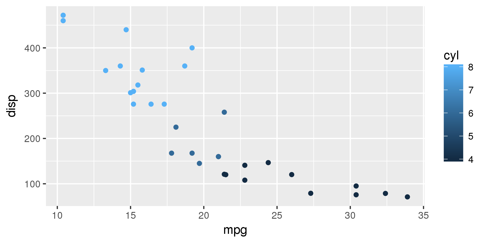

# パッケージ

## パッケージとは

### いろんな人がつくった便利な関数群

* `install.packages()`でインストール
* `library()`で読み込み
    * `require()`を使う人もいる。
* `detach()`でアンロード

```{r pkg_func, eval=FALSE}
install.packages("パッケージ名")
library(パッケージ名)
detach("package:パッケージ名", unload = TRUE)
```

## ヒアドキュメント {#install_with_heredoc}

* ヒアドキュメントでログをとる。
* インストール失敗時にべんり!
* windowsは使えない。

```bash
R --no-save << EOF > logfile 2>&1
install.packages("パッケージ名")
EOF
```


## tidyverse群

* よくつかわれるパッケージをまとめたもの
* データ処理につかう
* パイプ`%>%`が使える
* グラフをきれいにかける


```{r hadley_pkg, eval=FALSE}
install.packages("tidyverse")
library(tidyverse)
```

* インストール時につまづきやすい
* エラーを読むと解決する

## tidyverseの実践 {#tidy_example}

* ggplotについての例を示す
* tidyverseパッケージが必要
* ggplot2でもOK

```{r ready_tidyverse, eval = FALSE}
library(tidyverse)
```


## ggplot

* グラフをつくる関数
* レイヤーを重ねる
* 階層グラフィックス文法っていう書き方
* `geom`関数でプロットの形式を変えれる
* `ggsave()`で簡単にプロットを保存できる

とりあえずここまでにしておく。

---

```{r ggplot_ex, eval=FALSE}
mtcars_tibble <- as_tibble(mtcars)
ggplot(
  data = mtcars_tibble,
  mapping = aes(
    x = mpg,
    y = disp,
    color = cyl
    )
  ) +
  geom_point()
```

* tibbleという型をつかう
* `+`で関数をつなぐ



