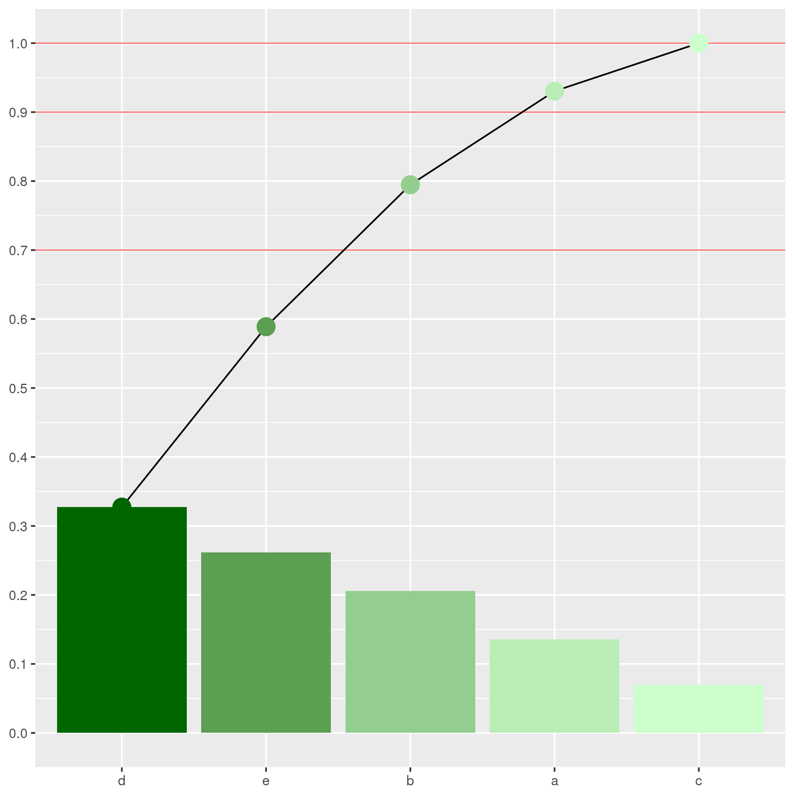

# データ

## read.csv

* 標準で使える読み込み関数
* `stringAsFactors = FALSE`にする
    * 文字列が変化するのを防ぐ
    
```r
read.csv("ファイル名", stringAsFactors = FALSE)
```

## read_csv

* tidyverse群に用意されてる関数(readr)

```r
read_csv(
  "ファイル名",
  locale = locale(encoding = "エンコード")
)
```

## write.csv

* 標準のcsv作成関数
* `row.names = FALSE`
    * 行名が追加されるのを防ぐ

## サンプルデータの作成

* Rにはさまざまなデータ作成関数がある
* `sample()`
* `runif()`
* `rnorm()`
* `rgamma()`

## sample

* `sample()`で単純なデータを作成できる
* `size`は何個とりだすか
* `replace`は複数回とりだせるか
* `prob`は確率を指定する。
    * 合計が1じゃなくても大丈夫

```{r sample_ex}
sample(1:100, size = 2)
```

## その他

|  関数   | 確率分布 |   使い方   |
|:-------:|:--------:|:-----------:
|`runif()`|一様分布|`runif(5)`|
|`rnorm()`|正規分布|`rnorm(5)`|
|`rgamma()`|ガンマ分布|`rgamma(5,shape = 2, rate = 5)`|
|`rbeta()`|ベータ分布|`rbeta(5, shape1 = 0.5, shape2 = 0.5)`|

* shapeはk, rateはシータ
* shape1はα, shape2はβ

# 使用例

## パレート図 {#pareto_graph}

```{r pareto_play}
prob_vec <- sample(1:5, size = 5)
vec1 <- sample(
  1:5,
  size = 10000,
  replace = TRUE,
  prob = prob_vec
)
replace_abcde <- function(vec1) {
  num <- 1
  for(moji in c("a", "b", "c", "d", "e")) {
    vec1[vec1 == num] <- moji
    num <- num + 1
  }
  assign("vec1", vec1, envir = parent.env(environment()))
}
replace_abcde(vec1)
result <- pareto_func(vec1)
result
```


* 図にすると

```{r pareto_tibble}
result <- as_tibble(result) %>% 
  mutate(
    name = names(result$count),
    count_density = count / sum(count)
  )
```

---

```{r pareto_graph, fig.show = "hide"}
result %>% 
  ggplot() +
  geom_hline(
    yintercept = c(0.7,0.9,1),
    size = 0.2,
    color = "#ff0000"
  ) +
  geom_bar(
    aes(name, count_density, fill = density),
    stat = "identity"
  ) +
  geom_line(aes(name, density, group ="1")) +
  geom_point(
    aes(name, density, color = density),
    size = 5
  ) +
  scale_x_discrete(limits = result$name) +
  scale_y_continuous(breaks = seq(0, 1, by = 0.1)) +
  scale_color_gradient(low = "#006600", high = "#ccffcc") +
  scale_fill_gradient(low = "#006600", high = "#ccffcc") +
#  viridis::scale_fill_viridis(option="inferno") +
#  viridis::scale_color_viridis() +
  coord_cartesian(ylim = c(0,1)) +
  labs(
    x = names(result$count),
    y = NULL
    ) +
  theme(legend.position = "none")

# ggsave("pareto_graph.png")
```

[見やすい方](newbie_workshop_pages.html#pareto_graph)


```{r import_pareto_graph, fig.width=6, fig.asp=0.618, out.width="70%", fig.align="center", echo=FALSE}

```
