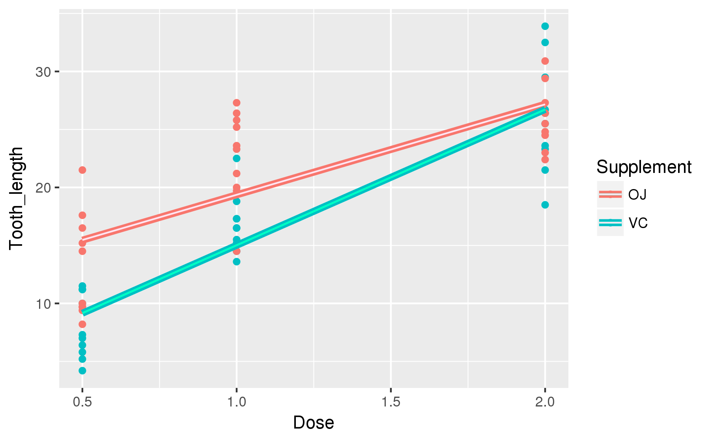

# 統計処理

## とりあえずやってみる。

* `ToothGrowth`というデータセットを使ってみる

```{r ToothGrowth_data}
head(ToothGrowth)
class(ToothGrowth)
```

---

* モルモットの歯のデータセット
    * `VC`かオレンジジュース(`Oj`)の用量と歯の長さ

```{r import_guinea-pig, fig.width=6, fig.asp=0.618, out.width="70%", fig.align="center", echo=FALSE}
knitr::include_graphics("Image/newbie_workshop_image/guinea-pig-242520_1920.jpg")
```


## 方針

1. tidyverse群がつかえるようにtibbleにする。
1. 列名をわかりやすくする
1. とりあえず散布図を作る
1. 他の処理について考える 

## tibble型の威力

```{r ToothGrowth_2_tibble}
ToothGrowth2 <- as_tibble(ToothGrowth)
ToothGrowth2 %>% head(2) %>% knitr::kable()
ToothGrowth2 %>% tail(2) %>% knitr::kable()
```

## 列名を変更する

* ここは参考ぐらいに

```{r ToothGrowth2_names}
names(ToothGrowth2) <- c("Tooth_length", "Supplement", "Dose")
ToothGrowth2 %>% head() %>% knitr::kable()
```

## 散布図で様子見

```{r ToothGrowth2_plot, fig.width=6, fig.asp=0.618, out.width="70%", fig.align="center"}
ToothGrowth2 %>% 
  ggplot(aes(Dose, Tooth_length, color = Supplement)) +
  geom_point()
```

## 線形回帰分析

* `lm()`を使う

```{r ToothGrowth2_lm}
ToothGrowth2_VC_lm <- lm(Tooth_length ~ Dose, data = ToothGrowth2 %>% filter(Supplement == "VC"))
ToothGrowth2_OJ_lm <- lm(Tooth_length ~ Dose, data = ToothGrowth2 %>% filter(Supplement == "OJ"))
ToothGrowth2_lm <- list(VC_lm = summary(ToothGrowth2_VC_lm), OJ_lm = summary(ToothGrowth2_OJ_lm))
ToothGrowth2_lm

# Tooth_length = 3.295 + 11.716 * Dose
# Tooth_length = 11.550 + 7.811 * Dose
```

---

* 回帰直線のプロット

```{r ToothGrowth2_lm_plot, fig.width=6, fig.asp=0.618, out.width="70%", fig.align="center"}
ToothGrowth2 %>% 
  group_by(Supplement) %>% 
  ggplot(aes(Dose, Tooth_length, color = Supplement)) +
  geom_point() +
  geom_smooth(method = "lm", se = FALSE)
```


# ベイズ

## ベイズ統計

* ToothGrowthでは母集団が少ない。
* なにもしていない時の歯の増加量がわからない。
* 特に事前情報がない。

<br/>

<h2>そんなときはベイズ</h2>

## baysian linear regression

* 要は線形回帰分析

```{r ToothGrowth2_lm_MCMC}
ToothGrowth2_VC_bayes_lm <- MCMCpack::MCMCregress(Tooth_length ~ Dose, ToothGrowth2 %>% filter(Supplement == "VC"), verbose = 10000)
ToothGrowth2_OJ_bayes_lm <- MCMCpack::MCMCregress(Tooth_length ~ Dose, ToothGrowth2 %>% filter(Supplement == "OJ"), verbose = 10000)
ToothGrowth2_bayes_lm <- list(VC_bayes_lm = summary(ToothGrowth2_VC_bayes_lm), OJ_bayes_lm = summary(ToothGrowth2_OJ_bayes_lm))
ToothGrowth2_bayes_lm

# 試行によって違いが出る。
# Tooth_length = 3.312 + 11.703 * Dose
# Tooth_length = 11.571 + 7.796 * Dose
```

---

```{r ToothGrowth2_lm_MCMC_plot, fig.width=6, fig.asp=0.618, out.width="70%", fig.align="center", eval=FALSE}
# Tooth_length = 3.312 + 11.703 * Dose
# Tooth_length = 11.571 + 7.796 * Dose
ToothGrowth2 %>% 
  group_by(Supplement) %>% 
  ggplot(aes(Dose, Tooth_length, color = Supplement)) +
  geom_point() +
  geom_smooth(method = "lm", se = FALSE, size = 2) +
  stat_function(
    fun = function(Dose) 3.312 + 11.703 * Dose,
    geom = "line",
    color = "#00ffc4",
    size = 0.6,
    xlim = c(0.5, 2.0),
    show.legend = TRUE
  ) +
  stat_function(
    fun = function(Dose) 11.571 + 7.796 * Dose,
    geom = "line",
    color = "#ffe4f1",
    size = 0.5,
    xlim = c(0.5, 2.0),
    show.legend = TRUE
  )
```


## MCMCregress

* `MCMCpack`パッケージを使う。
* `MCMCpack::MCMCregress`でMCMC法での回帰直線を作成する。
* デフォルトでバーンインは1000回,イテレーションは10000回
* verboseを設定すると進行状況と各変数の確率分布を`print`で表示できる。

---

MCMC法による線形回帰の結果を通常の線形回帰分析と重ねあわせてみると 

* だいたいおなじ
* あくまで目安


```{r import_ToothGrowth2_lm_MCMC_plot, fig.width=6, fig.asp=0.618, out.width="70%", fig.align="center", echo=FALSE}

```


# BayesFactor

## ベイズファクター

* 尤度を比較する指標
* 事後確率の比と事前確率の比の比
    * すごいわかりづらい

<br/>

<h2 id="h2_alone">ある仮説のときにデータがこうなってるよね?<br/>
これって別の仮説の時のデータだとしたらどっちいいんかな?ってこと</h2>

## anovaBF

* `BayesFactor::anovaBF`
    * 分散を解析する関数
* factorじゃないと使えないらしい
* 質的変数として扱えるならそうする
    * Doseは比例尺度と考えられる(量的変数)
    * 今回は順位尺度と見る

```{r anovaBF_error, error=TRUE}
bf <- BayesFactor::anovaBF(
  Tooth_length ~ Dose,
  data = ToothGrowth2
  )
```

## anovaBFの使用

* 公式にのっとってデータを整理していく

```{r anovaBF_2_factor}
ToothGrowth2$Dose <- factor(ToothGrowth2$Dose)
levels(ToothGrowth2$Dose) <- c("Low", "Medium", "High")
```

---

```{r calc_anovaBF}
bf <- BayesFactor::anovaBF(
  Tooth_length ~ Supplement * Dose,
  data = ToothGrowth2
  )
bf
```

---

* 今回はplotが用意されているので`plot()`を使う

```{r calc_anovaBF_plot, fig.width=6, fig.asp=0.618, out.width="70%", fig.align="center", echo=FALSE}
display_plot <- matrix(c(1, 0, 1, 0), 2, 2)
layout(display_plot)
plot(bf)
plot(bf[3:4]/bf[2])
```

## プロット結果

* 見た感じ`Supplement`は関係なさそう
* `Supplement + Dose + Supplement:Dose`で仮設を立てるのが最も良さそう

というわけで`factor`を`numeric`にするんですが 
少し失敗しました。笑 

```{r ToothGrowth2_2_numeric}
levels(ToothGrowth2$Dose) <- c(0.5, 1, 2)
ToothGrowth2$Dose <- as.numeric(as.character(ToothGrowth2$Dose))
str(ToothGrowth2$Dose)
```

## ふたたび線形回帰分析

* 手順は同じ

```{r ToothGrowth_lm_result}
# Tooth_length = b0 + b1*Supplement + b2*Dose + b3*Supplement*Dose
ToothGrowth_lm_result <- lm(Tooth_length ~ Supplement * Dose, data = ToothGrowth2)
summary(ToothGrowth_lm_result)
```

---

* ggplotを使っていく
* [見やすい方](newbie_workshop_pages.html#ToothGrowth_lm_result_table)


```{r ToothGrowth_lm_result_table}
ToothGrowth2 <- ToothGrowth2 %>% 
  mutate(
    Supplement_num = unclass(.$Supplement),
    Tooth_length_res = predict(ToothGrowth_lm_result)
  )
ToothGrowth2 %>% head() %>% knitr::kable()
```

---

```{r ToothGrowth_lm_result_plot, fig.width=6, fig.asp=0.618, out.width="70%", fig.align="center", echo=FALSE}
par(mfrow = c(2, 2))
plot(ToothGrowth_lm_result)
```

* 残差が同じぐらいの広がり
* 正規性が見て取れる
* クックの距離が0.5を超えているようなので当てはまりもよさそう

---

```{r ToothGrowth_lm_result_ggplot, fig.width=6, fig.asp=0.618, out.width="70%", fig.align="center"}
ToothGrowth2 %>% 
  ggplot(aes(Dose, color = Supplement)) +
  geom_point(aes(y = Tooth_length_res), position = position_jitter(width = 0.1, height = 1), color = "#0000ff") +
  geom_point(aes(y = Tooth_length), position = position_jitter(width = 0.1))
```

---

* 95%信頼区間でのみ`b3 * Supplement * Dose`が棄却される。
* イテレーションしたらもう少し違うかも。
